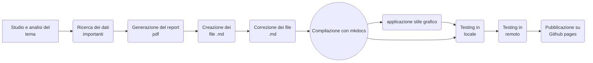

# Dashboard della salute 🩺
Una dashboard interattiva per gestire tutti i tuoi parametri vitali 

La dashboard è raggiungibile da qui: [dashboard della salute](https://michelefalcomer.github.io/)

# Obiettivi 
L'obiettivo principale era di creare un prodotto digitale che combinasse un report scientificamente accurato e un interfaccia grafica facile e intuitiva. 

# Strumenti utilizzati
* Mkdocs
* Overleaf
* Pandoc
* Github
* Visual studio code

# Struttura
Le tecnologie che ho adottato per fare questo progetto sono due: Overleaf per la parte del report.pdf e Mkdocs per generare un sito statico. Le pagine create per il sito statico vengono salvate all'interno della cartella ./docs . Il tema scelto per il sito è "material", che ho inserito all'interno del file mkdocs.yml. Ho utilizzato Github Pages per l'hosting da remoto del sito. Ho utilizzato due strutture differenti; Il sito ha un interfaccia e un utilizzo molto più semplice e intuitivo, il report invece utilizza un'interfaccia tecnica con una formattazione ben precisa. Questa scelta è data dal fatto che i temi trattati non possono essere trattati con leggerezza e ci vuole un supporto tecnico e scientificamente accurato per spiegare tutti i dati presenti. 

