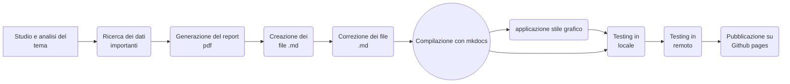

# Dashboard della salute 
Progetto realizzato durante il corso di Editoria Digitale del prof. Paolo Ceravolo. 

La dashboard interattiva è raggiungibile tramite questa pagina [Dashboard della salute](https://michelefalcomer.github.io/)

Gli obiettivi principali di questo progetto erano quelli di creare un report interattivo e personalizzato per comprendere al meglio i dati raccolti dai loro dispositivi smart e dare dei consigli in base alle necessità di ogni utente. Principalmente ho sviluppato una componente interattiva(dashboard) e un report meno interattivo. Questi due prodotti si completano a vicenda e permettono di capire meglio i dati che vengono rilevati dai vari dispositivi in suo possesso. Per rendere molto più divertente e stimolante l'attività fisica, ho deciso di inserire una classifica utenti con dei premi ogni mese. Il mio obiettivo era quello di stimolare le persone a fare del loro meglio per arrivare primi in classifica. Tramite questa sana competizione gli utenti vengono inconsciamente "obbligati" a fare molta più attività fisica e quindi il loro stato di salute migliora di conseguenza. 

I temi presentati in questo progetto sono molto importanti per la salute generale delle persone e spesso passano in secondo piano perchè considerati non importanti. Tramite questo progetto ho cercato di sviluppare un interesse verso il benessere fisico in modo da aiutare quante più persone possibile a sviluppare delle sane abitudini. Ho cercato di includere informazioni scientifiche, che ho estratto da organizzazioni che si occupano proprio del benessere delle persone, ma in modo molto essenziale. Dal mio punto di vista per generare interesse non bisogna sovraccaricare di informazioni gli utenti ma dargli gli strumenti necessari per approfondire gli argomenti che gli interessano particolarmente. Le descrizioni che sono presenti nel report sono abbastanza dettagliate: ho inserito una breve descrizione dei vari dati raccolti cercando di spiegare l'importanza di tenere controllati quei particolari valori.

# Destinatari
I destinatari di questo prodotto sono definiti da diverse categorie: le persone che fanno attività fisica regolarmente e le persone che fanno attività fisica in modo sporadico. In base alla categoria si deve anche cambiare approccio nel comunicare i dati. Infatti, anche inspirato dalla "modalità atleta" di molte applicazioni, per le persone attive ho cercato di usare una presentazione dei dati più dettagliata con obiettivi un pò più rigidi, mentre per le persone più sedentarie ho cercato di avere un approccio più morbido. L'importanza di usare due approcci diversi è fondamentale, infatti se avessi usato lo stesso approccio per entrambe le categorie non raggiungerei i risultati sperati. Con in mente queste due grandi categorie ho cercato anche di definire delle categorie anche per i metodi di fruizione. In questo senso ho usato un approccio generale cercando di combinare la comodità di un sito web con la flessibilità del pdf. In questo modo si può accedere ai dati da qualsiasi dispositivo, sia il pdf che il sito si adattano a ogni dispositivo, e si possono condividere le proprie statistiche con amici e parenti. 

I dati presenti nel report sono stati acquisiti in maniera ibrida. Una parte è stata estratta manualmente utilizzando applicazioni e siti ufficiali, mentre l'altra parte è stata generata automaticamente. Ho deciso di prendere i dati da applicazioni come "salute" di Apple, che al suo interno contiene delle brevi descrizioni dei valori presenti. Le ho modificate e integrate nel report(pdf) così da avere le descrizioni. I dati generati automaticamente sono tutti i valori messi all'interno del report e del sito per puro scopo di esempio. 

# Struttura
Le tecnologie che ho adottato per fare questo progetto sono due: Overleaf per la parte del report.pdf e Mkdocs per generare un sito statico. Le pagine create per il sito statico vengono salvate all'interno della cartella ./docs . Il tema scelto per il sito è "material", che ho inserito all'interno del file mkdocs.yml. Ho utilizzato Github Pages per l'hosting da remoto del sito. Ho utilizzato due strutture differenti; Il sito ha un interfaccia e un utilizzo molto più semplice e intuitivo, il report invece utilizza un'interfaccia tecnica con una formattazione ben precisa. Questa scelta è data dal fatto che i temi trattati non possono essere trattati con leggerezza e ci vuole un supporto tecnico e scientificamente accurato per spiegare tutti i dati presenti. 

Ho confrontato il mio progetto principalmente con l'applicazione salute di Apple e FitDays (applicazione per l'uso di una bilancia smart). Grazie alla prima app ho preso spunto per creare delle descrizioni previ ma dettagliate dei valori raccolti. Le ho modificate e inserite all'interno del pdf così da fornire agli utenti una spiegazione concisa ma efficace. FitDays invece mi ha ispirato grazie alla sua "modalità atleta", da questa è nata l'idea di creare un report dettagliato e un sito dove sono contenuti solo i grafici rilevanti dei dati. Le fonti che ho consultato per gli standard di salute invece sono aziende ospedaliere italiane e il sito dell'OMS. Grazie a queste sono riuscito a inserire nel report dei consigli per raggiungere gli obbiettivi e le linee guida/ gli standard minimi per essere in salute. I principali limiti di questo progetto sono l'acquisizione dei dati. Infatti per la maggiorparte dei dati è stata fatta una selezione manuale dei dati e descrizioni. Un metodo per migliorare questo processo sarebbe quello di integrare direttamente database e applicazioni già esistenti per la generazione automatica dei dati. 

I risultati che ho ottenuto tramite questo progetto sono soddisfacenti. La mia idea iniziale era quella di creare una dashboard che fosse facile da usare e tecnica al punto giusto. Secondo me sono riuscito a coniugare le due cose in modo abbastanza efficiente. Infatti le persone meno interessate alla parte tecnica possono usare solo il sito web, mentre le persone che vogliono entrare nel dettaglio per capire le motivazioni dei vari dati possono usare il report in pdf. 

# Bibliografia e sitografia 
* https://www.grupposandonato.it/ Gruppo San Donato
* https://www.humanitas.it/ Humanitas
* https://www.who.int/ Organizzazione mondiale della sanità
* https://www.apple.com/it/health/ Apple salute
