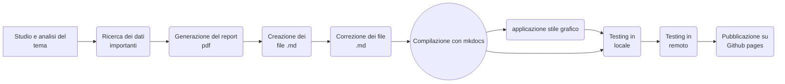

# Dashboard della salute 
La dashboard interattiva è raggiungibile attraverso questo link: [dashboard della salute](https://michelefalcomer.github.io/)

# Struttura
In questo repository sono contenute tutte le cartelle che sono state utilizzate per la creazione del progetto. In particolare nella cartella ./docs sono presenti tutti i file .md che sono serviti per la creazione delle varie pagine del sito web statico. È presente anche il file "report.pdf" che servirà alla sezione "report" per visualizzare il pdf collegato. Nella cartella ./docs/images sono presenti le immagini che ho utilizzato nel sito. Sempre nella cartella ./docs è presente il codice di Latex che ho utilizzato per la creazione del pdf.
Il sito è stato creato tramite l'utilizzo di Mkdocs e il pdf tramite l'utilizzo di Overleaf. Sono partito facendo una ricerca su quali fossero i dati più importanti che un dispositivo smart tiene in condiderazione. Una volta trovati tutti i dati importanti sono passato alla creazione del pdf, al suo interno sono presenti diverse sezione dove in ognuna si può trovare la descrizione del dato preso in considerazione. Una volta finito, corretto e rivisto il pdf sono passato alla creazione di tutti i file .md. Il sito creato con Mkdocs è stato testato prima in locale così da poter correggere tutti gli errori commessi. Una volta finito il testing ho applicato uno stile grafico e poi, tramite Github Pages, ho "pubblicato" il sito in remoto. 

