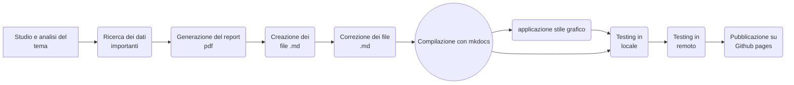

# Dashboard della salute 
La dashboard interattiva è raggiungibile attraverso questo link: [dashbord della salute](https://michelefalcomer.github.io/)

```mermaid
graph LR
A[Studio e analisi del<br> tema] --> B
B(Ricerca dei dati <br> importanti) --> C
C(Generazione del report <br> pdf) --> D
D(Creazione dei <br> file .md) --> E
E(Correzione dei file <br> .md) --> F
F((Compilazione con mkdocs)) --> G
G(applicazione stile grafico) --> H
F --> H(Testing in <br> locale) --> I
I(Testing in <br> remoto) --> J
J(Pubblicazione su <br> Github pages)
```
