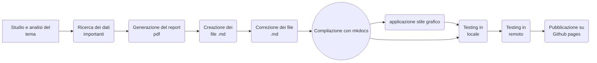

{width=100px height=100px}

# Dashboard della salute

Il repository del progetto è presente qui: [Repository](https://github.com/michelefalcomer/Dashboard-salute)

La dashboard della salute è disponibile qui: [Dashboard](https://michelefalcomer.github.io/)

## Introduzione e obiettivi
Il principale obiettivo di questo progetto è la creazione di un report interattivo e personalizzato che consenta agli utenti di analizzare i dati raccolti dai loro dispositivi smart e ricevere consigli su misura in base alle loro esigenze. Il progetto si compone di due elementi complementari: una dashboard interattiva e un report statico. Insieme, questi strumenti permettono di interpretare più facilmente i dati rilevati dai vari dispositivi, offrendo un quadro chiaro e dettagliato sul proprio stato di salute.

Per incentivare l'attività fisica in modo divertente e stimolante, ho introdotto un sistema di classifiche con premi mensili per i migliori utenti. Questo elemento di competizione spinge le persone a migliorare costantemente le proprie prestazioni, trasformando l'esercizio fisico in una sfida coinvolgente.

Oltre a dare un beneficio diretto agli utenti, il progetto può avere un impatto positivo anche sulla comunità scientifica. Un numero maggiore di persone sarà motivato a condividere i propri dati, contribuendo così all'espansione del database sulle informazioni relative alla salute. Questo potrebbe supportare la ricerca e lo sviluppo di nuove strategie per promuovere uno stile di vita più sano.

## Tema  
I temi presentati in questo progetto sono molto importanti per la salute generale delle persone e spesso passano in secondo piano perchè considerati non importanti. Tramite questo progetto ho cercato di sviluppare un interesse verso il benessere fisico in modo da aiutare quante più persone possibile a sviluppare delle sane abitudini. Ho cercato di includere informazioni scientifiche, che ho estratto da organizzazioni che si occupano proprio del benessere delle persone, ma in modo molto essenziale. Dal mio punto di vista per generare interesse non bisogna sovraccaricare di informazioni gli utenti ma dargli gli strumenti necessari per approfondire gli argomenti che gli interessano particolarmente. Le spiegazioni che sono presenti nel report sono abbastanza dettagliate: ho inserito una breve descrizione dei vari dati raccolti cercando di spiegare l'importanza di tenere controllati quei particolari valori. L'importanza di queste descrizioni è fondamentale poichè serve una base solida per capire tutte le informazioni presentate.

## Destinatari
I destinatari di questo prodotto sono definiti da diverse categorie: le persone che fanno attività fisica regolarmente e sporadicamente. In base alla categoria si deve anche cambiare approccio nel comunicare i dati. Infatti, anche ispirato dalla "modalità atleta" di molte applicazioni, per il primo gruppo ho cercato di usare una presentazione dei dati più dettagliata con obiettivi un pò più rigidi, mentre per il secondo gruppo ho cercato di avere un metodo più morbido. L'importanza di usare due approcci diversi è fondamentale, infatti se avessi usato la stessa strategia per entrambe le categorie non saremmo in grado di raggiungere i risultati sperati. Con in mente queste due grandi sezioni ho cercato di definire delle categorie anche per i metodi di fruizione. In questo senso ho usato un approccio generale cercando di combinare la comodità di un sito web con la flessibilità del pdf. In questo modo si può accedere ai dati da qualsiasi dispositivo, sia il pdf che il sito si adattano facilmente a qualsiasi tipo di schermo senza dover cambiare la struttura stessa; e si possono condividere le proprie statistiche con amici e parenti. La fruizione tramite pdf e sito web in contemporanea mi permette di avere due modelli d'uso differenti. Il modello del sito è interattivo, semplice e intuitivo. Pensato principalmente per le persone che fanno attività fisica sporadicamente o che hanno bisogno di tenere monitorati solo determinati dati. Il pdf è stato ideato con in mente il primo gruppo di persone, coloro che fanno allenamenti in modo regolare. Questo modello permette di essere stampato e usato in ambienti professionali, per atleti di livello agonistico o semplicemente per tutti quelli interessati ad approfondire i vari argomenti. 

## Processo di produzione 
Come prima cosa ho cercato di analizzare quali fossero i dati fondamentali da tenere in considerazione. In questa prima parte ho raccolto informazioni dai siti delle organizzazioni, applicazioni competitor e ChatGpt. Ho cercato di capire quali fossero i punti chiave delle maggiori app in commercio e quali i punti deboli e ho cercato di combinare i vari dati. Per prima cosa ho analizzato e raggruppato tutte i parametri presi in considerazioni in base a delle categorie ben precise, per esempio: i dati del cuore, quelli legati all'attività motoria e al ciclo del sonno. Una volta definite le categorie sono passato alla stesura del report in pdf. In questa fase ho cercato di capire quali fossero le esigenze di una persona sportiva. Il metodo migliore per presentare questi dati era una relazione scientifica con delle descrizioni dettagliate ma concise. A questo scopo mi è tornata molto utile l'applicazione "salute" di Apple che al suo interno raccoglie le descrizioni di tutti i dati in suo possesso. Ho fatto una prima stesura e ho rettificato gli errori o insesattezze confrontando il documento con i dati presenti online. 
Successivamente sono passato alla seconda fase, la creazione del sito web. Il sito web è stato creato con l'intento di essere utilizzato da persone meno interessate a fare attività sportiva in maniera agonistica, quindi al suo interno contiene solo le informazioni necessarie alla vita quotidiana. Ho estrapolato i dati dal report e ho inserito solo quelli fondamentali. Una volta che tutte le pagine .md sono state create ho ideato lo stratagemma delle classifiche e l'ho inserito nel sito. Sempre all'interno del sito sono presenti dei grafici esempio per i parametri vitali presi in considerazione. Questi diagrammi sono stati creati attraverso l'uso di E-charts.

Per la creazione dei contenuti ho utilizzato una modalità semi-automatica, ho fatto generare alcuni dati a ChatGpt con la mia supervisione e correzione per verificare l'esattezza dei dati. La maggior parte di essi sono stati estratti manualmente, selezionando le fonti da cui prendere le informazioni. Questo processo diventa fondamentale per una possibile distribuzione del prodotto, bisognerebbe verificare per ogni singola risorsa la licenza in uso e i diritti che questa possiede. 
Lo stile grafico del pdf è lasciato in gestione a Overleaf, infatti l'obiettivo era dare forma a un report professionale. Il sito web ovviamente dovrebbe avere un interfaccia grafica accattivante che invogli l'utilizzo del prodotto stesso. 

I dati raccolti, prima di una possibile pubblicazione, andrebbero completati (ho inserito solo un esempio delle possibili informazioni) e verificati in modo approfondito. Ho cercato di inserire anche un incipit per la generazione automatica dei dati tramite l'uso di una cartella clinica. La mia idea era quella di usare i parametri vitali della persona e in base a quelli eseguire un confronto con le linee guida ufficiali. Questo aspetto andrebbe implementato in modo tale da rendere la generazione completamente autonoma e personalizzata. 

## Tecnologie
Le principali tecnologie e strumenti che ho utilizzato per la stesura di questo progetto sono: 
- Overleaf: stesura e impaginazione del report in pdf                   
- Mkdocs: generazione di un sito statico                    
- Visual Studio Code: sviluppo delle pagine .md                  
- Github: creazione repository con tutti i file del progetto e hosting tramite Github pages                   
- ChatGpt: generazione semi-automatica dei dati presenti nel report              
- Siti vari: raccolta informazioni                                
  [repository github](https://github.com/michelefalcomer/Dashboard-salute)

## Risultati raggiunti
I risultati di questo progetto sono stati raggiunti rispetto all'idea iniziale, ma ci sarebbero molte modifiche da fare per rendere il prodotto stesso quanto più efficente possibile. 
Si potrebbe ridurre sia il costo sia il tempo di generazione dei contenuti automatizzando la ricerca e analisi delle informazioni. Per ridurre eventuali errori nella generazione di questi dati si potrebbe creare un database, aggiornato costantemente, in modo tale da confrontare i nuovi parametri con quelli presenti al suo interno. In questo modo l'algoritmo porterebbe a un risultato molto più affidabile e sicuro. 

## Confronto con lo stato d'arte
Ho confrontato il mio progetto principalmente con l'applicazione salute di Apple e FitDays (applicazione per l'uso di una bilancia smart). Grazie alla prima app ho preso spunto per creare delle descrizioni brevi ma dettagliate dei valori raccolti. Le ho modificate e inserite all'interno del pdf così da fornire agli utenti una spiegazione concisa ma efficace. FitDays invece mi ha ispirato grazie alla sua "modalità atleta", da questa è nata l'idea di creare un report dettagliato e un sito dove sono contenuti solo i grafici rilevanti. Le fonti che ho consultato per gli standard di salute invece sono aziende ospedaliere italiane e organizzazioni internazionali. Grazie a queste sono riuscito a inserire nel report dei consigli per raggiungere gli obbiettivi, linee guida e gli standard minimi per essere in salute. 

## Limiti emersi 
I principali limiti che sono emersi durante la creazione di questo progetto riguardano principalmente la gestione dei dati. Infatti la maggior parte dei parametri presenti nel mio progetto sono stati generati manualmente. Un'implementazione di un algoritmo automatico renderebbe il processo molto più semplice e veloce. Questo potrebbe essere fatto tramite un'integrazione diretta con i dispositivi smart. 
Un altro limite è la sincronia; il pdf che presenta il sito non è generato dinamicamente, ma bisogna aggiornarlo manualmente. Ho cercato di superare questo problema inserendo una sezione denominata "cartella clinica" dove gli utenti hanno la possibilità di aggiornare le loro informazioni in modo costante e periodico. Il report poi dovrebbe acquisire i dati dalla pagina, confrontarli con il database centrale e creare dei consigli ad-hoc per ogni persona. 

## Conclusioni 

I risultati che ho ottenuto tramite questo progetto sono soddisfacenti. La mia idea iniziale era quella di creare una dashboard che fosse facile da usare e tecnica al punto giusto. Secondo me sono riuscito a coniugare le due cose in modo abbastanza efficiente. Infatti le persone meno interessate alla parte tecnica possono usare solo il sito web, mentre coloro che vogliono entrare nel dettaglio per capire le motivazioni dei vari dati possono usare il report in pdf. 

## Bibliografia e sitografia 
- [@GruppoSanDonato]
- [@Humanitas]
- [@OMS]
- [@AppleSalute]
- [@MayoClinic]
- [@Wikipedia]
- [@MinisteroSalute]
- [@SleepFoundation]
- [@Heart]
- [@JamaMedicine]
